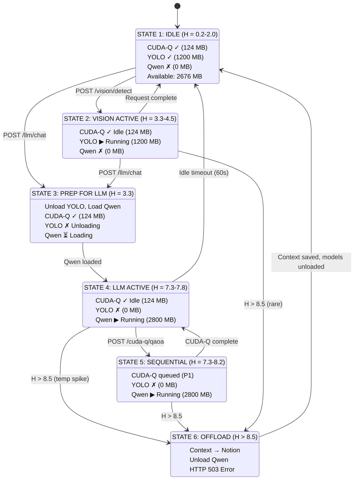
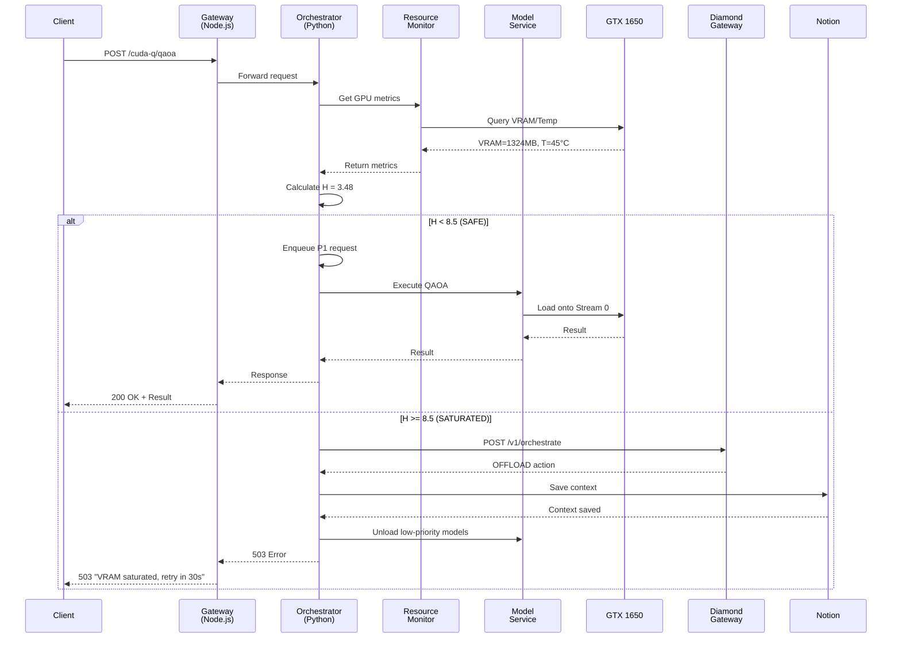
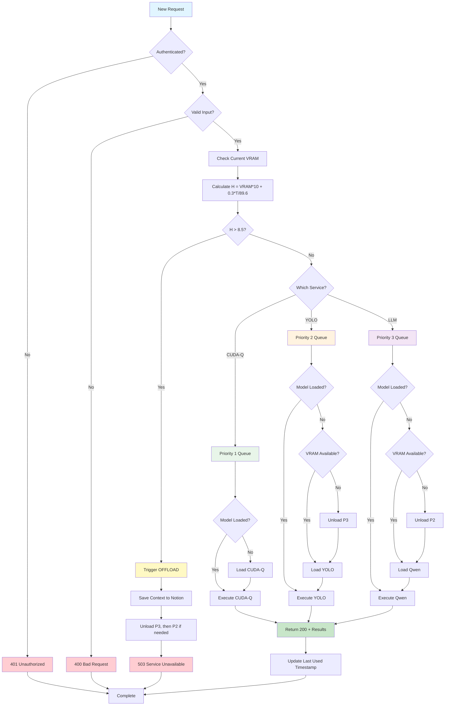
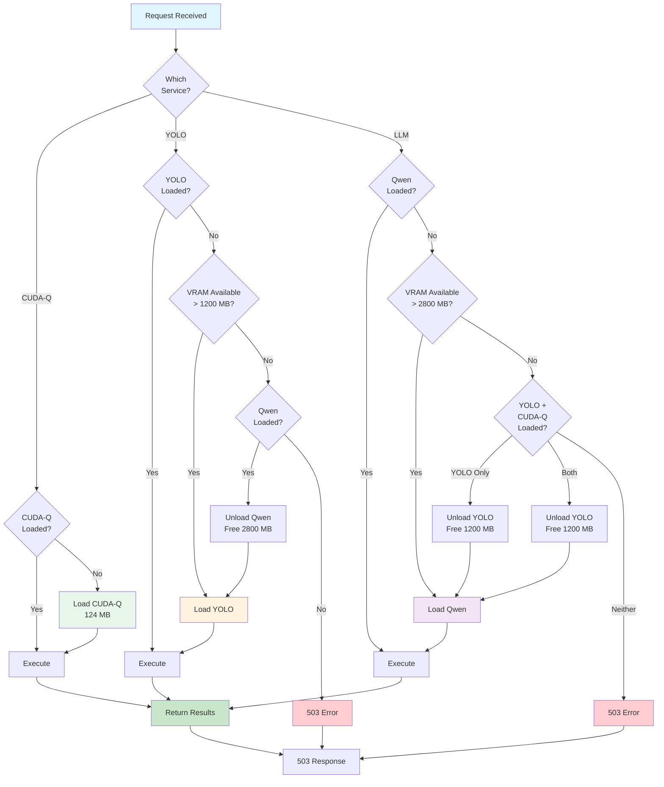
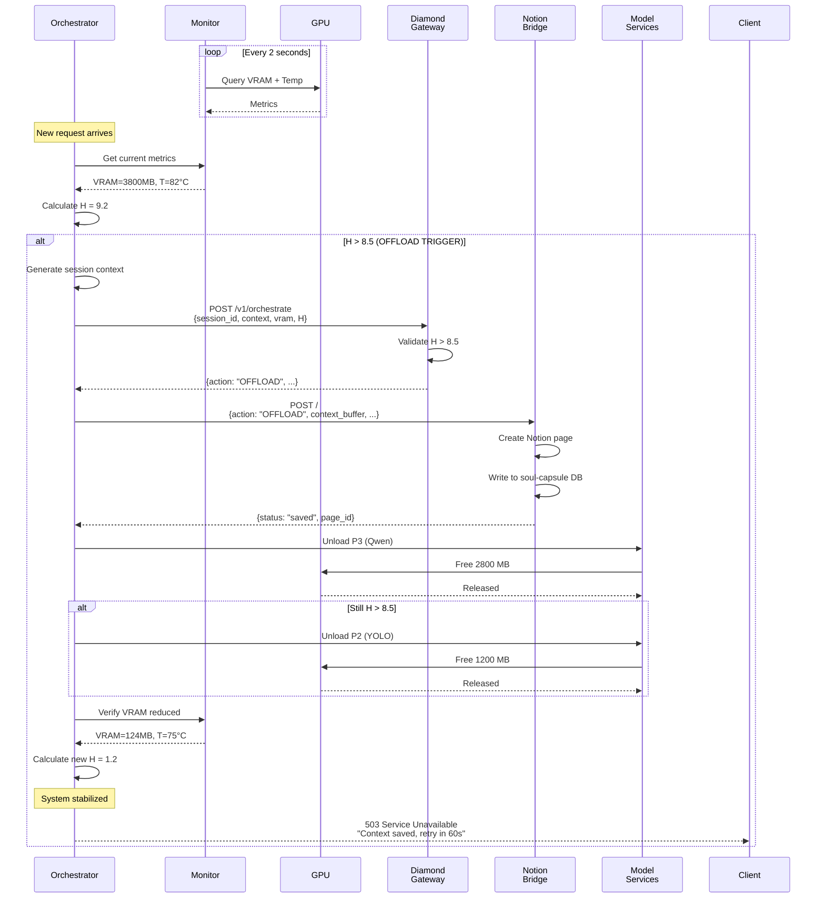
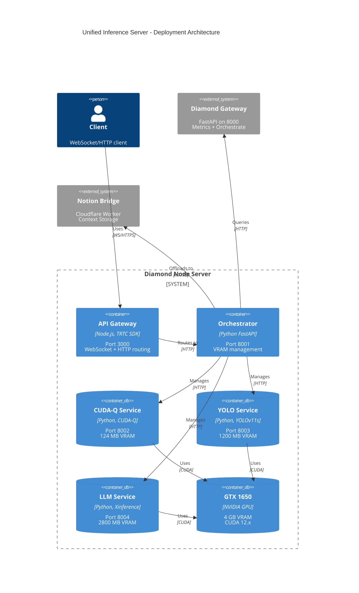
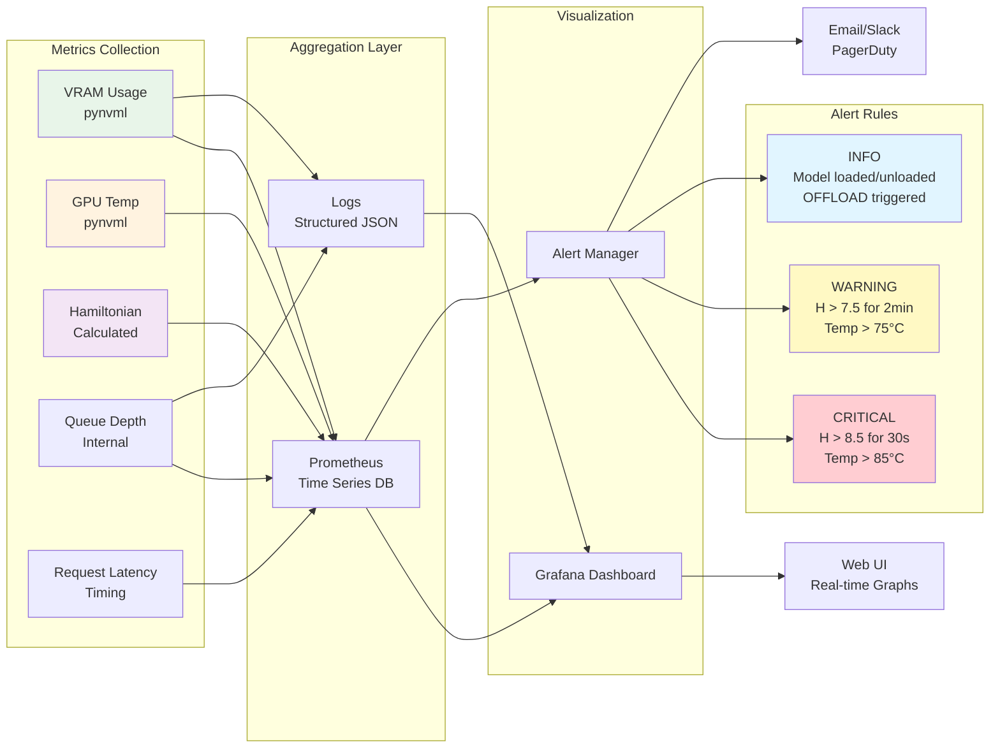

# Unified Inference Server - Architecture Diagrams (Mermaid)

## 1. System Architecture

```mermaid
graph TB
    subgraph Clients["Client Layer"]
        WS[WebSocket Clients]
        HTTP[HTTP/REST Clients]
        TRTC[TRTC Streaming]
    end

    subgraph Gateway["API Gateway (Node.js - Port 3000)"]
        Router[Request Router]
        Auth[Authentication]
        LB[Load Balancer]
        WS_Handler[WebSocket Handler]
    end

    subgraph Orchestrator["Orchestration Layer (Python FastAPI - Port 8001)"]
        VRAM[VRAM Orchestrator<br/>H = (VRAM/Total)*10 + 0.3*(T/89.6)]
        Monitor[Resource Monitor<br/>pynvml]
        Queue[Priority Queue<br/>P1: CUDA-Q<br/>P2: YOLO<br/>P3: LLM]
        Offload[Offload Client<br/>Diamond Gateway → Notion]
    end

    subgraph Services["Model Services"]
        CUDAQ[CUDA-Q Service<br/>124 MB, P1]
        YOLO[YOLO11s Service<br/>1200 MB, P2]
        LLM[Qwen 1.5 Service<br/>2800 MB, P3]
    end

    subgraph GPU["GTX 1650 (4 GB VRAM)"]
        Stream0[CUDA Stream 0<br/>CUDA-Q]
        Stream1[CUDA Stream 1<br/>YOLO11s]
        Stream2[CUDA Stream 2<br/>Qwen]
    end

    subgraph External["External Services"]
        DG[Diamond Gateway<br/>Port 8000]
        Notion[Notion Bridge<br/>Cloudflare Worker]
    end

    WS --> Router
    HTTP --> Router
    TRTC --> WS_Handler
    
    Router --> Auth
    Auth --> LB
    LB --> VRAM
    WS_Handler --> VRAM

    VRAM --> Monitor
    VRAM --> Queue
    VRAM --> Offload

    Queue --> CUDAQ
    Queue --> YOLO
    Queue --> LLM

    CUDAQ --> Stream0
    YOLO --> Stream1
    LLM --> Stream2

    Offload --> DG
    DG --> Notion

    Monitor -.->|Poll VRAM/Temp| GPU

    classDef clientStyle fill:#e1f5ff,stroke:#01579b,stroke-width:2px
    classDef gatewayStyle fill:#fff3e0,stroke:#e65100,stroke-width:2px
    classDef orchStyle fill:#f3e5f5,stroke:#4a148c,stroke-width:2px
    classDef serviceStyle fill:#e8f5e9,stroke:#1b5e20,stroke-width:2px
    classDef gpuStyle fill:#ffebee,stroke:#b71c1c,stroke-width:3px
    classDef externalStyle fill:#f1f8e9,stroke:#33691e,stroke-width:2px

    class WS,HTTP,TRTC clientStyle
    class Router,Auth,LB,WS_Handler gatewayStyle
    class VRAM,Monitor,Queue,Offload orchStyle
    class CUDAQ,YOLO,LLM serviceStyle
    class Stream0,Stream1,Stream2,GPU gpuStyle
    class DG,Notion externalStyle
```

---

## 2. VRAM State Machine



---

## 3. Request Flow (Sequence Diagram)



---

## 4. VRAM Allocation Timeline

```mermaid
gantt
    title VRAM Allocation Over Time
    dateFormat X
    axisFormat %s

    section CUDA-Q (P1)
    Always Loaded: cudaq, 0, 60

    section YOLO11s (P2)
    Loaded: yolo1, 0, 30
    Unloaded: yolo_off, 30, 40
    Loaded Again: yolo2, 40, 60

    section Qwen 1.5 (P3)
    Unloaded: qwen_off1, 0, 30
    Loading: qwen_load, 30, 33
    Running: qwen_run, 33, 40
    Idle TTL: qwen_idle, 40, 42
    Unloaded: qwen_off2, 42, 60

    section Hamiltonian
    H=3.3 (Safe): h1, 0, 30
    H=7.8 (Orange): h2, 30, 40
    H=3.3 (Safe): h3, 40, 60
```



---

## 5. Priority Queue Flow



---

## 6. Model Loading Decision Tree



---

## 7. OFFLOAD Flow



---

## 8. Deployment Architecture



---

## 9. Monitoring Dashboard Components



---

## How to Use These Diagrams

### Viewing Online
1. Copy any diagram block (between \`\`\`mermaid and \`\`\`)
2. Paste into [Mermaid Live Editor](https://mermaid.live/)
3. View rendered diagram

### Embedding in Documentation
- GitHub Markdown: Renders automatically
- Notion: Use Mermaid block
- Confluence: Install Mermaid plugin

### Exporting
```bash
# Install mermaid-cli
npm install -g @mermaid-js/mermaid-cli

# Export as PNG
mmdc -i diagram.mmd -o diagram.png

# Export as SVG
mmdc -i diagram.mmd -o diagram.svg
```

---

**File:** `UNIFIED_INFERENCE_DIAGRAMS.md`  
**Version:** 1.0  
**Last Updated:** 2025-05-12  
**Format:** Mermaid.js
